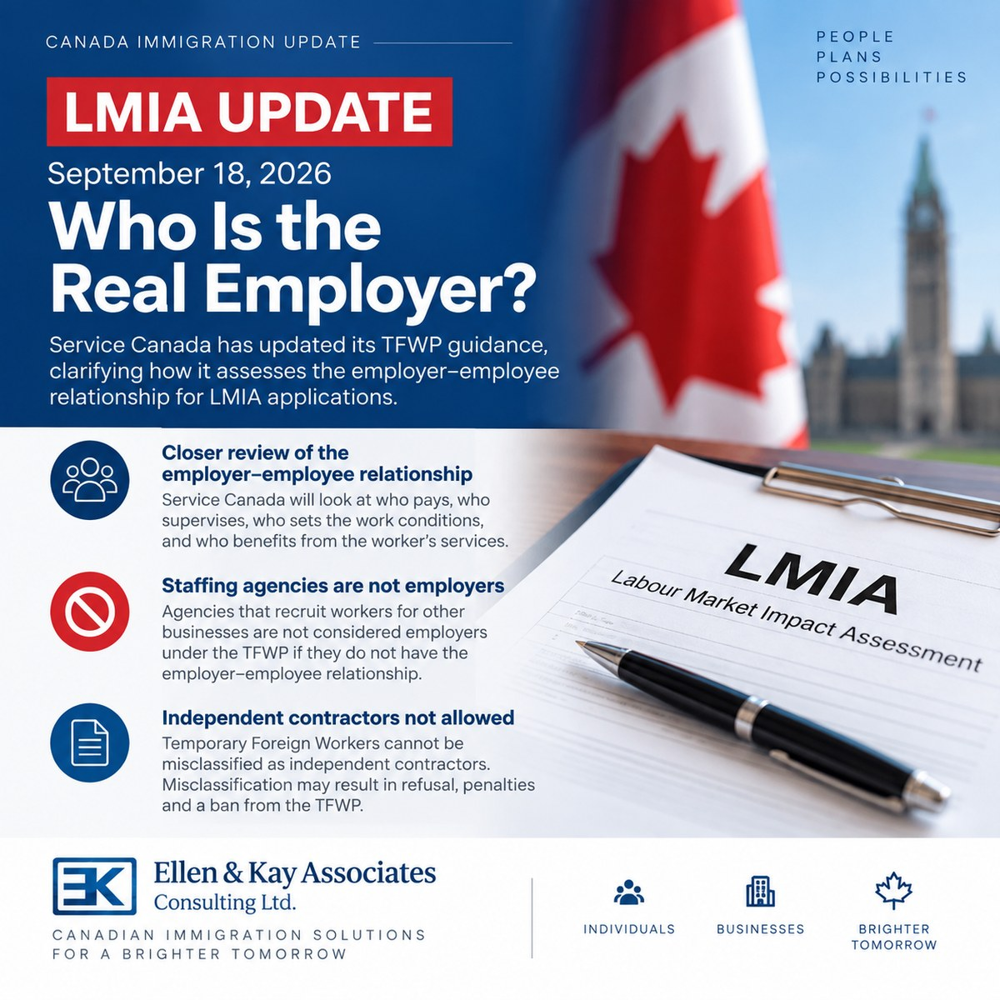

<a class="back-link" href="../policy-updates.html">← 返回政策观察 | Back to Policy Insights</a>

LMIA | Temporary Foreign Worker Program

# LMIA新规定：谁才是真正的雇主？

<a class="language-jump" href="#english-version">Read in English</a>

2026年9月18日，Service Canada更新了临时外国工人计划 （Temporary Foreign Worker Program，TFWP）的雇主要求， 进一步明确了在LMIA申请中，如何判断谁才是真正的雇主。

## 不能只看LMIA是谁申请的

申请LMIA的公司，必须是真正雇用外国工人的公司。

Service Canada在审理时可能会考虑：

-   谁支付工资；
-   谁安排工作时间和地点；
-   谁决定工作职责；
-   谁负责日常管理和监督；
-   谁有权解雇员工；
-   谁与员工签署雇佣合同；
-   外国工人实际上为谁工作。

简单来说，不能只是把一家公司的名字写在LMIA申请上， 实际却由另一家公司使用和管理这名员工。

## 劳务派遣和招聘公司需要特别注意

如果劳务派遣公司或招聘中介只是帮助其他企业招聘或提供员工， 而自己并不是真正的雇主，一般不能以自己的名义申请LMIA， 再把外国工人派到其他公司工作。

因此，涉及劳务派遣、人力供应、分包或关联公司共同使用员工的LMIA申请， 需要特别注意实际的雇佣关系。

## 外国工人不能被当作“独立承包人”

Service Canada此次也明确指出，通过临时外国工人计划聘用的外国工人， 不能被错误地安排为独立承包人。

雇主也不能在取得LMIA之后改变双方关系， 通过承包方式来规避工资、工资单或其他雇主义务。

违反规定可能导致LMIA被拒、罚款， 甚至被禁止参加临时外国工人计划。

## 对雇主有什么影响？

如果公司的用工结构比较复杂，在递交LMIA之前， 最好先确认几个问题：

-   谁付工资？
-   谁管理员工？
-   谁安排工作？
-   谁可以解雇员工？
-   外国工人实际上为哪家公司提供服务？

如果这些答案指向的公司与LMIA申请公司不同， 就需要在递交申请前进一步审查。

另外，一个雇主有多个工作地点， 与多个不同公司共同使用一名外国工人，是两回事。

这次更新传递的信息很明确： <strong>LMIA申请不仅要看公司名称，更要看实际的雇佣关系。</strong>

对于准备申请LMIA的雇主，特别是存在关联公司、 多个经营地点或较复杂用工安排的企业， 建议在递交申请前先把雇佣关系梳理清楚。

<h2>Important LMIA Update: Who Is the Real Employer?</h2>
On September 18, 2026, Service Canada updated its Temporary Foreign Worker Program (TFWP) guidance with an important clarification on the employer–employee relationship.

For LMIA purposes, it is not enough for a company simply to be named as the employer on the application. Service Canada may look at the actual employment relationship, including:
<ul><li>Who pays the worker directly?</li><li>Who determines the job duties, work location and schedule?</li><li>Who supervises the worker and sets performance expectations?</li><li>Who has the authority to dismiss the worker?</li><li>Who signs the employment agreement?</li><li>Which business actually benefits from the worker’s services?</li></ul>
This is particularly important for staffing agencies, labour suppliers, subcontracting arrangements and related companies sharing workers.
<h3>Independent Contractors</h3>
Service Canada also makes another point very clear: Temporary Foreign Workers cannot be misclassified as independent contractors. An employer cannot obtain an LMIA and then restructure the relationship to treat the worker as a contractor in order to avoid payroll, compensation or other TFWP requirements.

For employers considering an LMIA, especially where the corporate or employment structure is complex, it is increasingly important to review the real employer–employee relationship before filing.

<h3>Multiple Work Locations vs. Multiple Businesses</h3>
Multiple work locations may be possible in appropriate circumstances. But multiple work locations are not the same as multiple businesses sharing the same foreign worker.

For immigration practitioners and employers, this is a useful reminder: <strong>the substance of the employment relationship matters, not simply the name appearing on the LMIA application.</strong>

