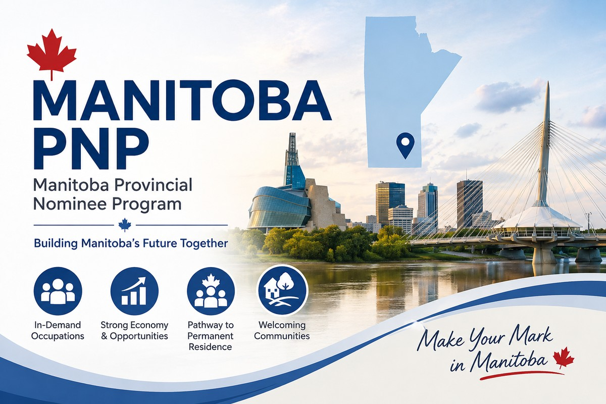

<a class="back-link" href="../provincial-nominee-programs.html">← 返回省提名项目 | Back to Provincial Nominee Programs</a>

MANITOBA MPNP | EOI DRAW #280

# 曼省9月24日发出474份邀请：自然及应用科学类职业成为本轮重点

<a class="language-jump" href="#english-version">Read in English</a>

2026年9月24日，曼省省提名计划（MPNP）进行了第280轮意向表达（EOI）抽选，共发出 474份申请建议函（LAA）。其中，417份发给目前在曼省从事自然及应用科学相关职业的申请人，是本轮最大的邀请群体。

## 本轮抽选结果

<table class="mpnp-data-table">
<thead>
<tr><th>抽选组别</th><th>邀请数量</th><th>最低EOI分数</th></tr>
</thead>
<tbody>
<tr><td>曼省在职：全科及家庭医生（NOC 31102）</td><td>1</td><td>未公布</td></tr>
<tr><td>曼省在职：自然及应用科学及相关职业（NOC大类2）</td><td>417</td><td>760</td></tr>
<tr><td>法语申请人</td><td>16</td><td>未公布</td></tr>
<tr><td>战略招聘计划获邀申请人</td><td>40</td><td>未公布</td></tr>
<tr><td>合计</td><td>474</td><td>—</td></tr>
</tbody></table>

其中，148名获邀申请人申报了有效的Express Entry档案号码及求职者验证代码。这148人已包含在474人的总数中。

## 760分并不是所有申请人的统一门槛

本轮公布的760分，仅适用于在曼省从事自然及应用科学及相关职业的高分筛选组。其他组别没有公布最低分数，不能把760分理解为整个曼省省提名计划的统一邀请线。

法语组别则要求申请人在EOI中申报以法语与MPNP沟通，并提供有效的法语考试成绩。战略招聘组别涉及已获得MPNP相关招聘计划直接邀请的申请人。

## 对申请人有什么启示？

本轮结果显示，曼省仍在按不同职业、语言背景及招聘计划进行针对性筛选。邀请数量本身，并不意味着所有申请人的获邀机会都同步增加。

对于已经在曼省工作的申请人，应重点核对职业分类、工作情况及EOI申报内容。官方特别提醒，语言考试号码缺失、成绩过期，或战略招聘邀请号码不正确，都可能影响获邀。涉及受监管职业的申请人，还需要能够证明已完成在曼省执业所需的许可手续。

收到邀请只是申请的开始，准确的EOI和完整的证明材料同样重要。

如果你正在曼省工作，或希望了解自己的背景是否适合曼省省提名，欢迎联系 Ellen & Kay Associates。我们可以协助评估申请通道、核对职业分类，并提前检查申请材料。

<a href="https://immigratemanitoba.com/2026/09/expression-of-interest-draw-280/">官方来源：MPNP第280轮抽选公告</a>

<a class="back-link" href="../provincial-nominee-programs.html">← 返回省提名项目 | Back to Provincial Nominee Programs</a>

<h2>Manitoba Issues 474 Invitations in September 24 Draw, with a Focus on Natural and Applied Sciences</h2>

On September 24, 2026, the Manitoba Provincial Nominee Program (MPNP) held Expression of Interest (EOI) Draw #280, issuing 474 Letters of Advice to Apply (LAAs).

The largest group consisted of 417 candidates currently employed in Manitoba in natural and applied sciences and related occupations.

<h3>Draw results</h3>

<table class="mpnp-data-table">
<thead>
<tr><th>Selection group</th><th>LAAs issued</th><th>Lowest EOI score</th></tr>
</thead>
<tbody>
<tr><td>Manitoba employment: General practitioners and family physicians (NOC 31102)</td><td>1</td><td>Not published</td></tr>
<tr><td>Manitoba employment: Natural and applied sciences and related occupations (NOC broad category 2)</td><td>417</td><td>760</td></tr>
<tr><td>Francophone selection</td><td>16</td><td>Not published</td></tr>
<tr><td>Strategic recruitment initiatives</td><td>40</td><td>Not published</td></tr>
<tr><td>Total</td><td>474</td><td>—</td></tr>
</tbody></table>

Of the 474 candidates invited, 148 declared a valid Express Entry profile number and job seeker validation code. These candidates are included in the total.

<h3>760 is not a universal invitation threshold</h3>

The lowest score of 760 applied only to the selection of top-scoring candidates employed in Manitoba in natural and applied sciences and related occupations. No minimum score was published for the other groups.

The Francophone selection considered candidates who declared French as their language of communication with the MPNP and provided a valid French language test result. The strategic recruitment selection considered candidates who declared a direct invitation from the MPNP through a qualifying recruitment initiative.

<h3>What should applicants take from this draw?</h3>

This round illustrates Manitoba’s targeted approach to selection based on occupation, language and recruitment initiatives. The total number of invitations alone does not mean that every applicant’s chances have increased.

Applicants working in Manitoba should review their occupational classification, employment details and EOI declarations carefully. The official notice warns that missing language test numbers, expired test results or incorrect strategic recruitment invitation numbers can affect selection. Applicants in regulated occupations must also be able to demonstrate that they have completed the necessary licensing requirements to work in Manitoba.

An invitation is the beginning of the application process. Accurate declarations and supporting evidence remain essential.

If you are working in Manitoba or considering the MPNP, Ellen &amp; Kay Associates can help assess suitable pathways, review your occupational classification and identify documents to prepare before you receive an invitation.

<a href="https://immigratemanitoba.com/2026/09/expression-of-interest-draw-280/">Official source: MPNP Expression of Interest Draw #280</a>

<a class="back-link" href="../provincial-nominee-programs.html">← 返回省提名项目 | Back to Provincial Nominee Programs</a>

