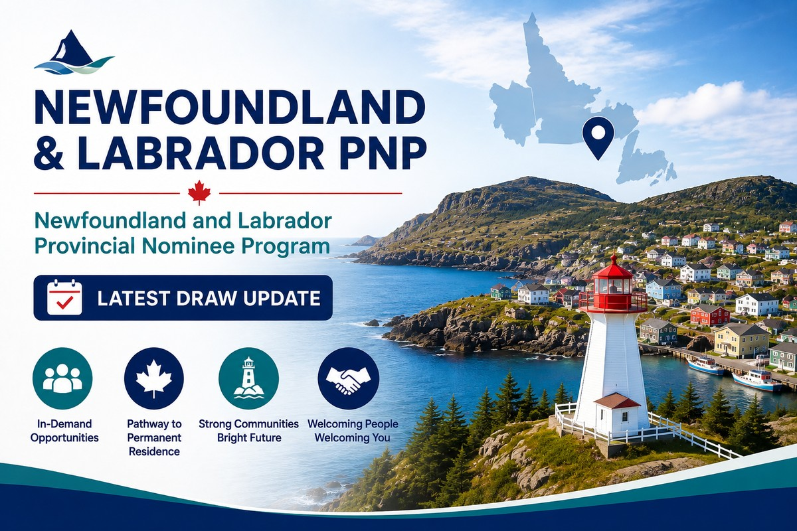

<a class="back-link" href="../provincial-nominee-programs.html">← 返回省提名项目 | Back to Provincial Nominee Programs</a>

NLPNP | Provincial Immigration

# 纽芬兰与拉布拉多省9月四轮邀请：小批量选择，申请人应关注什么？

<a class="language-jump" href="#english-version">Read in English</a>

2026年9月25日，纽芬兰与拉布拉多省发出 41份省提名计划（NLPNP）申请邀请，本轮没有大西洋移民计划（AIP）邀请。这是该省9月份的第四轮邀请。

<h2>9月份邀请情况</h2>

<table class="nlpnp-data-table"><thead><tr><th>日期</th><th>NLPNP邀请</th><th>AIP邀请</th><th>合计</th></tr></thead><tbody><tr><td>9月4日</td><td>97</td><td>0</td><td>97</td></tr><tr><td>9月10日</td><td>36</td><td>0</td><td>36</td></tr><tr><td>9月18日</td><td>61</td><td>1</td><td>62</td></tr><tr><td>9月25日</td><td>41</td><td>0</td><td>41</td></tr><tr><td>9月合计</td><td>235</td><td>1</td><td>236</td></tr></tbody></table>

官方记录显示，9月份每轮邀请数量介于36至97份之间，呈现频繁、小批量邀请的特点。不过，这并不意味着申请门槛降低，也不能据此预测下一轮的时间或数量。

<h2>符合条件之外，还要关注选择优先级</h2>

省政府公布的EOI优先考虑因素包括医疗相关职业、农村及区域社区的用工需求、申请人长期留省的可能性，以及雇主的合规和员工留任记录等。本省毕业生、法语申请人及有较强安置支持的申请，也可能获得优先考虑。但符合其中一项或多项因素，并不保证收到邀请。

这些是整体选择指引，不能直接当作9月25日这一轮所有获邀者的具体条件。

<h2>对申请人有什么启示？</h2>

准备申请时，除了确认项目资格，还应检查自己的职业、工作地点、雇主情况及定居计划，是否能够清楚体现与该省劳动力需求的联系。

同时，NLPNP与AIP应分别观察。9月份只有1份AIP邀请，说明两类项目当月的邀请数量差异明显；但9月25日没有AIP邀请，并不等于AIP已经暂停。

如果你已获得当地工作机会，或正在考虑通过纽芬兰与拉布拉多省申请移民，欢迎联系 Ellen &amp; Kay Associates Consulting。我们可以结合你的职业、雇主及个人背景，评估适合的申请路径，并协助准备EOI与后续材料。

官方来源：<a href="https://www.gov.nl.ca/immigration/invitations-to-apply-updates/">邀请记录</a> · <a href="https://www.gov.nl.ca/immigration/expression-of-interest-model-prioritization-criteria/">EOI优先考虑因素</a>

<a class="back-link" href="../provincial-nominee-programs.html">← 返回省提名项目 | Back to Provincial Nominee Programs</a>

<h2>Newfoundland and Labrador Holds Four Invitation Rounds in September: What Should Applicants Watch?</h2>

On September 25, 2026, Newfoundland and Labrador issued 41 Invitations to Apply under the Newfoundland and Labrador Provincial Nominee Program (NLPNP). No Atlantic Immigration Program (AIP) invitations were issued in that round. It was the province’s fourth invitation round in September.

<h3>September invitation results</h3>

<table class="nlpnp-data-table"><thead><tr><th>Date</th><th>NLPNP invitations</th><th>AIP invitations</th><th>Total</th></tr></thead><tbody><tr><td>September 4</td><td>97</td><td>0</td><td>97</td></tr><tr><td>September 10</td><td>36</td><td>0</td><td>36</td></tr><tr><td>September 18</td><td>61</td><td>1</td><td>62</td></tr><tr><td>September 25</td><td>41</td><td>0</td><td>41</td></tr><tr><td>September total</td><td>235</td><td>1</td><td>236</td></tr></tbody></table>

September’s results show a pattern of frequent, smaller invitation batches, ranging from 36 to 97 invitations per round. This does not establish that selection requirements have eased or predict the timing or size of future rounds.

<h3>Eligibility and selection priorities both matter</h3>

The province’s published Expression of Interest (EOI) priorities include healthcare occupations, rural and regional labour needs, an applicant’s likelihood of remaining in the province, and an employer’s compliance and employee retention record.

Graduates with ties to Newfoundland and Labrador, Francophone applicants, and candidates with strong settlement support may also receive priority. However, meeting one or more priority factors does not guarantee an invitation. These are general selection guidelines, rather than a confirmed breakdown of the September 25 recipients.

<h3>What does this mean for applicants?</h3>

Applicants should look beyond basic program eligibility and consider how their occupation, work location, employer and settlement plans align with provincial priorities.

NLPNP and AIP results should also be monitored separately. September’s single AIP invitation shows a substantial difference in invitation activity between the two programs that month. The absence of AIP invitations on September 25, however, does not establish that the program has been paused.

If you have a job opportunity in Newfoundland and Labrador or are considering immigration through the province, Ellen &amp; Kay Associates Consulting can help assess suitable pathways and prepare your EOI and supporting documents.

Official sources: <a href="https://www.gov.nl.ca/immigration/invitations-to-apply-updates/">Invitation results</a> · <a href="https://www.gov.nl.ca/immigration/expression-of-interest-model-prioritization-criteria/">EOI prioritization criteria</a>

<a class="back-link" href="../provincial-nominee-programs.html">← 返回省提名项目 | Back to Provincial Nominee Programs</a>

