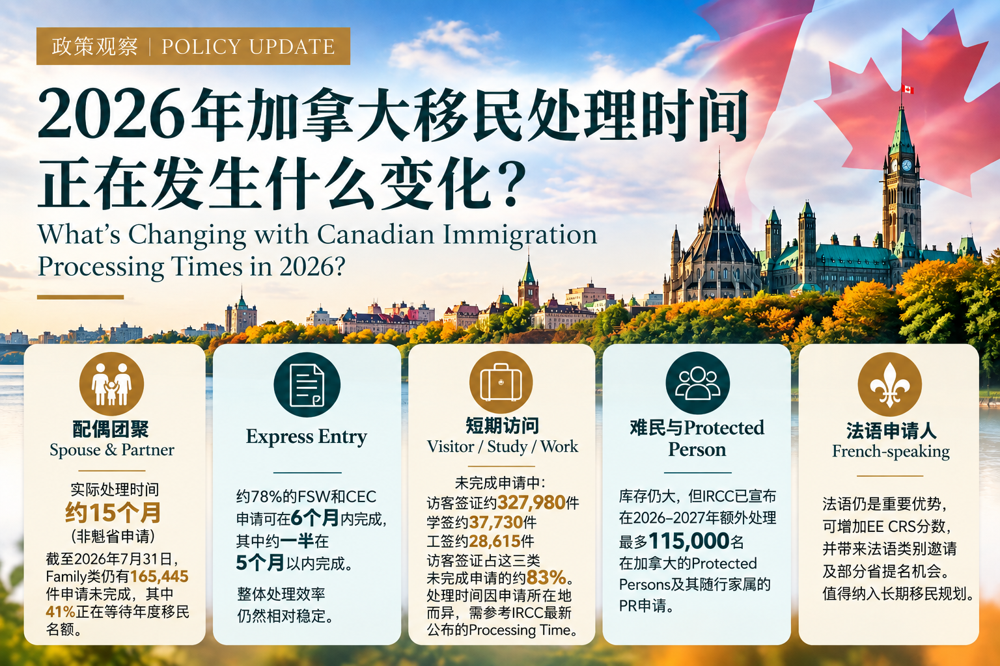

<a class="back-link" href="../policy-updates.html">← 返回政策观察 | Back to Policy Insights</a>

Canadian Immigration | Processing Times

# 2026年加拿大移民处理时间正在发生什么变化？

<a class="language-jump" href="#english-version">Read in English</a>

最近不少申请人都在问：加拿大移民和签证是不是越来越慢了？

从 IRCC 公布的数据来看，并不能简单地用“快”或“慢”来概括。不同申请类别正在出现明显分化，其中最值得关注的是配偶团聚、Express Entry 和短期访问类申请。

## 配偶团聚：等待时间有所延长

配偶担保一直以 12个月 Service Standard 作为重要参考。

但 IRCC 数据显示，2025年8月至2026年7月，非魁省 Spouse、Partner and Children 类别的实际处理时间约为 15个月。

截至2026年7月31日，Family Immigration 仍有 165,445件申请尚未完成，其中41%正在等待年度移民名额。

因此，申请人除了参考 IRCC Processing Time，也需要对实际等待时间保持更现实的预期。复杂案件、补件或 PFL 等情况还可能进一步延长处理时间。

## Express Entry：整体相对稳定

Express Entry 的情况则相对稳定。

IRCC 数据显示，2025年8月至2026年7月，约 78%的 FSW 和 CEC 申请能够在6个月 Service Standard 内完成，其中约一半在5个月以内完成。

这说明目前永久居民申请的处理压力并不是平均分布在所有类别，Express Entry 整体仍保持相对稳定的处理效率。

## 短期访问：不同国家差异明显

Temporary Residence 的情况又有所不同。

截至2026年7月31日，IRCC 尚未完成的申请中，Visitor Visa 约 327,980件，Study Permit 约 37,730件，Work Permit 约 28,615件。

其中 Visitor Visa 占这三类 pending inventory 的约83%。

更重要的是，TRV Processing Time 会因申请所在地而出现明显差异。因此，现在已经很难笼统地告诉客户“加拿大旅游签证大概需要多久”，而应该根据申请所在地及当时 IRCC 公布的 Processing Time 具体判断。

## Protected Persons 与法语申请人

Protection/H&C 仍然存在较大的申请库存。不过 IRCC 已宣布将在2026–2027年额外处理最多 115,000名已经在加拿大的 Protected Persons 及其 in-Canada dependants 的永久居民申请。

与此同时，法语仍然是加拿大移民政策的重要方向。对于符合条件的申请人，法语可能带来额外 CRS 分数、Express Entry 法语类别邀请以及部分省提名机会。

## 政策观察

目前加拿大移民申请并不是“全面变慢”，而是呈现出越来越明显的类别差异：

配偶团聚等待时间有所增加，Express Entry 整体相对稳定，而短期访问签证则越来越需要根据申请国家分别判断。

因此，在规划加拿大移民或签证申请时，不能只看一个 Processing Time 数字。申请类别、当前库存、年度移民名额以及申请所在地，都可能影响最终的等待时间。

<h2>What Is Changing with Canadian Immigration Processing Times in 2026?</h2>

A common question among applicants is whether Canadian immigration and visa processing is simply getting slower.

Recent IRCC data suggests a more complicated picture. Processing trends vary significantly by program, particularly for spousal sponsorship, Express Entry and temporary residence applications.

<h3>Spousal Sponsorship: Longer Waits</h3>

Spousal sponsorship has traditionally been associated with a 12-month service standard.

However, IRCC data indicates that between August 2025 and July 2026, processing for Spouse, Partner and Children applications outside Quebec was approximately 15 months.

As of July 31, 2026, Family Immigration had 165,445 applications still in inventory, with 41% awaiting immigration levels space.

Applicants should therefore look beyond the published processing-time estimate and maintain realistic expectations, particularly where a case involves additional document requests, procedural fairness concerns or other complexities.

<h3>Express Entry: Relatively Stable</h3>

Express Entry remains comparatively stable.

According to IRCC data, approximately 78% of FSW and CEC applications were finalized within the six-month service standard between August 2025 and July 2026, with about half completed within five months.

This illustrates that processing pressures are not evenly distributed across all permanent residence programs.

<h3>Temporary Residence: Location Matters</h3>

Temporary residence shows a different pattern.

As of July 31, 2026, IRCC&#x27;s pending inventory included approximately 327,980 visitor visa applications, 37,730 study permit applications and 28,615 work permit applications.

Visitor visas represented roughly 83% of the pending inventory across these three categories.

TRV processing times can also vary substantially depending on the country or location of application. For this reason, applicants should check the current IRCC processing time applicable to their application location, rather than relying on a general estimate for Canadian visitor visas.

<h3>Protected Persons and French-Speaking Applicants</h3>

Protection/H&amp;C remains an area with significant inventory. IRCC has announced plans to process up to 115,000 additional permanent residence applications from protected persons already in Canada and their in-Canada dependants in 2026–2027.

French-language ability also continues to play an important role in Canada&#x27;s immigration system. Eligible applicants may benefit from additional CRS points, French-language Express Entry category invitations and certain provincial nominee opportunities.

<h3>Policy Watch</h3>

The current picture is therefore not one of immigration processing becoming slower across the board.

Spousal sponsorship is experiencing longer waits, Express Entry remains comparatively stable, while temporary residence processing increasingly varies by application location.

When planning an immigration or visa application, the published processing-time figure should be considered together with the program category, current inventory, annual immigration levels and application location.

