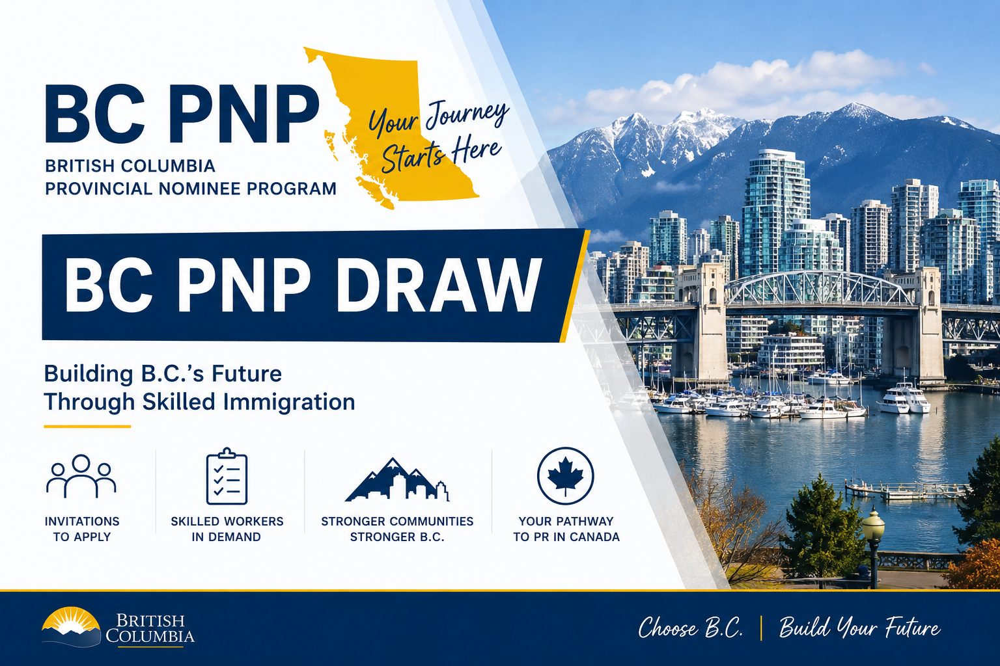

<a class="back-link" href="../provincial-nominee-programs.html">← 返回省提名项目 | Back to Provincial Nominee Programs</a>

BC PNP | September 2026 Draws

# BC PNP 9月四轮抽选：高经济影响人才成为重要方向

<a class="language-jump" href="#english-version">Read in English</a>

2026年9月，BC省提名计划（BC PNP）进行了四轮邀请，涵盖技术移民、农村及偏远地区医疗支持项目以及企业家移民。

从本月的抽选可以看到，BC PNP目前的选择方向越来越清晰：医疗、幼教、建筑等紧缺行业继续获得定向支持，同时，高经济影响人才成为另一个非常重要的邀请方向。

## 9月10日：幼教、医疗和建筑继续获得邀请

9月10日，BC PNP进行了新一轮职业定向邀请：

幼教（Childcare）：182人，最低99分

医疗（Health）：143人，最低76分

建筑技工（Construction Trades）：104人，最低94分

兽医相关职业（Veterinary Care）：最低90分，邀请少于5人

与8月6日相比，幼教最低分从102降至99，医疗从84降至76；建筑类则从88升至94。

这说明不同优先行业之间的竞争情况并不完全相同，申请人不能只参考上一轮分数判断自己的机会。

## 9月17日：农村及偏远地区医疗支持项目再次抽选

9月17日，Temporary Rural/Remote Health Support Initiative 再次发出33份邀请，最低分为60分。

这是BC省2026年推出的一项临时措施，主要支持在农村及偏远地区公共卫生系统工作的部分符合条件人员。该项目的注册截止日期已经延长至2026年10月7日晚上11:59（BC时间）。

## 9月22日：企业家移民继续邀请

企业家移民方面，9月22日也进行了新一轮抽选：

Base Stream：10份邀请，最低119分

Regional Stream：少于5份邀请，最低119分

这说明BC PNP企业家类别目前仍在持续运行并发出邀请。

## 9月24日：714份High Economic Impact邀请

本月规模最大的一轮出现在9月24日。

BC PNP通过 Innovate: High Economic Impact 发出了714份邀请：

426人通过高工资标准获得邀请：时薪至少$52、年薪至少$105,000，并且职位属于NOC TEER 0、1、2或3；

另外288人通过积分获得邀请，最低分为131分。

值得注意的是，8月20日同类抽选的工资标准还是$55/小时、$110,000/年，积分最低132分。到了9月24日，工资门槛降至$52/小时、$105,000/年，积分线也降至131分。

## BC PNP正在形成更明确的选择方向

从9月份四轮邀请来看，BC PNP已经不再只是简单按照一个统一分数线选择申请人。

目前BC PNP的三个核心方向是 Care、Build和Innovate：

Care重点支持医疗、幼教、教育和兽医等领域；  
Build重点支持建筑和基础设施相关紧缺技工；  
Innovate则通过High Economic Impact邀请，吸引能够为BC省经济发展带来较高贡献的人才。

因此，对于目前已经在BC工作、准备申请BC PNP的人来说，除了计算自己的注册分数，更重要的是判断自己的职业、工资水平、专业资格以及雇主情况是否符合BC省目前的优先选择方向。

特别是医疗、幼教、建筑技工以及工资较高的TEER 0–3申请人，建议重新检查自己的BC PNP条件和最新分数。

BC PNP并没有停止，机会也仍然存在，但现在的邀请越来越有针对性。找到适合自己的类别，比单纯追逐某一轮最低分更加重要。

<a class="back-link" href="../provincial-nominee-programs.html">← 返回省提名项目 | Back to Provincial Nominee Programs</a>

<h2>BC PNP September 2026: Four Rounds of Invitations and a Growing Focus on High Economic Impact</h2>

The British Columbia Provincial Nominee Program (BC PNP) conducted four rounds of invitations in September 2026, covering Skills Immigration, the Temporary Rural/Remote Health Support Initiative, and Entrepreneur Immigration.

The September draws show an increasingly clear direction: B.C. continues to prioritize workers in health care, childcare and construction, while candidates with high economic impact have also become an important focus.

<h3>September 10: Childcare, Health and Construction</h3>

On September 10, the BC PNP conducted targeted Skills Immigration draws:

Childcare: 182 invitations, minimum score of 99

Health: 143 invitations, minimum score of 76

Construction trades: 104 invitations, minimum score of 94

Veterinary care: fewer than 5 invitations, minimum score of 90

Compared with the August 6 draws, the minimum score for childcare decreased from 102 to 99, while health dropped from 84 to 76. Construction, however, increased from 88 to 94.

This shows that competition can vary significantly between priority sectors. Candidates should not rely solely on the score from a previous draw when assessing their prospects.

<h3>September 17: Rural and Remote Health Support</h3>

On September 17, the Temporary Rural/Remote Health Support Initiative issued 33 invitations, with a minimum score of 60.

This temporary initiative supports certain eligible workers employed within B.C.’s public health system in rural and remote communities.

The registration deadline for this initiative has been extended to October 7, 2026 at 11:59 p.m. Pacific Time.

<h3>September 22: Entrepreneur Immigration</h3>

BC PNP also conducted an Entrepreneur Immigration draw on September 22:

Base Stream: 10 invitations, minimum score of 119

Regional Stream: fewer than 5 invitations, minimum score of 119

The draw confirms that both Entrepreneur Immigration streams continue to issue invitations.

<h3>September 24: 714 High Economic Impact Invitations</h3>

The largest BC PNP draw of the month took place on September 24.

Under Innovate: High Economic Impact, the province issued 714 invitations:

426 invitations were based on a high-wage threshold of at least $52 per hour and $105,000 per year for occupations in NOC TEER 0, 1, 2 or 3;

another 288 invitations were issued based on registration scores, with a minimum score of 131.

For comparison, the August 20 High Economic Impact draw used a wage threshold of $55 per hour and $110,000 per year, while the minimum registration score was 132.

The September draw therefore opened the door to a somewhat broader group of high-wage candidates.

<h3>A Clearer Direction for BC PNP</h3>

The September draws demonstrate that BC PNP selection is becoming increasingly targeted.

The province is currently focusing on three main areas: Care, Build and Innovate.

Care focuses on priority occupations such as health care, childcare, education and veterinary care.

Build supports workers in construction and infrastructure-related trades.

Innovate, including the High Economic Impact selection, focuses on candidates who can make a significant economic contribution to British Columbia.

For people already working in B.C. and considering BC PNP, the registration score is therefore only part of the assessment. Occupation, wage level, professional qualifications and employer circumstances may all affect whether a candidate fits within the province’s current priorities.

Candidates working in health care, childcare, construction trades, or higher-wage TEER 0–3 occupations may wish to review their eligibility under the latest BC PNP selection criteria.

BC PNP continues to provide immigration opportunities, but invitations are becoming increasingly targeted. Understanding where your profile fits within B.C.’s priorities is now more important than simply following the minimum score from the latest draw.

<a class="back-link" href="../provincial-nominee-programs.html">← 返回省提名项目 | Back to Provincial Nominee Programs</a>

