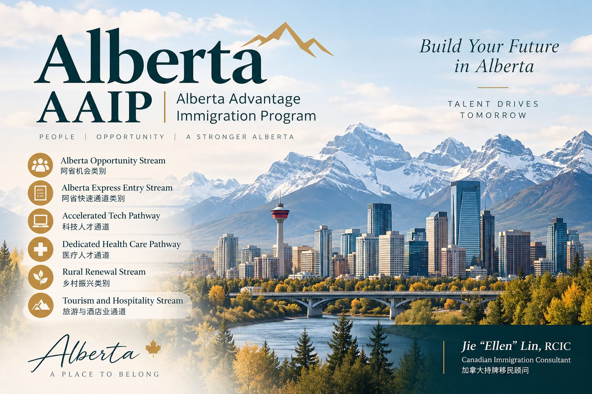

<a class="back-link" href="../alberta-aaip.html">← 返回阿尔伯塔省提名 | Back to Alberta AAIP</a>

ALBERTA AAIP | SEPTEMBER 2026 DRAWS

# 阿省9月密集抽选：科技、医疗、制造业和AOS持续发出邀请

<a class="language-jump" href="#english-version">Read in English</a>

2026年9月，Alberta Advantage Immigration Program（AAIP）连续进行了多轮抽选，涉及 Alberta Opportunity Stream（AOS）、科技、医疗、制造业、农业以及执法人员等多个方向。

从9月的抽选情况来看，一个趋势越来越明显：阿省并不是简单按照EOI分数从高到低邀请，而是越来越强调行业和劳动力市场需求。

## 9月AAIP抽选情况

截至9月23日，阿省9月份已经公布以下抽选：

- 9月1日Alberta Opportunity Stream：575人，最低56分

- 9月3日Accelerated Tech Pathway：96人，最低60分

- 9月9日Dedicated Health Care Pathway – Express Entry：51人，最低60分

- 9月10日Priority Sectors – Manufacturing：48人，最低60分

- 9月15日Priority Sectors – Agriculture：18人，最低60分

- 9月18日Priority Sectors – Health Care：100人，最低62分

- 9月21日Law Enforcement Pathway：少于10人，最低49分

- 9月22日Accelerated Tech Pathway：100人，最低59分

- 9月23日Alberta Opportunity Stream：113人，最低58分

可以看到，9月份的抽选覆盖范围相当广，而且科技、医疗以及AOS都不止一次发出邀请。

## 2026年阿省配额还剩多少？

截至9月23日，AAIP 2026年的省提名配额为 6,603个，已经发出 5,221个 nomination，剩余 1,382个名额；目前待处理申请约为 1,092份。

虽然年度配额已经使用了大部分，但阿省目前仍然在持续进行抽选。

## 分数并不是唯一决定因素

这是今年AAIP特别值得注意的一点。

AAIP官方明确说明，EOI分数并不是选择申请人的唯一因素。抽选还会结合阿省劳动力市场需求、行业优先方向、可用提名配额以及申请数量等因素。

2026年阿省明确列出的重点领域包括：

Health Care、Technology、Construction、Manufacturing、Aviation、Agriculture，以及 Rural Renewal communities。

因此，对于准备AAIP的申请人来说，不能只看：“我的EOI有多少分？”

还应该进一步看：“我的职业和雇主是否属于阿省目前重点需要的行业？”

例如，9月23日AOS最低分为58分，而9月22日科技通道最低59分，9月21日Law Enforcement甚至只有49分。不同类别之间的分数并不能简单横向比较，因为每轮抽选背后的行业和选择条件可能不同。

## 对申请人的实际意义

如果申请人目前已经在阿省工作，或者正在考虑通过阿省雇主寻找移民机会，科技、医疗、制造业、农业和建筑等行业仍然值得重点关注。特别是对于已经有阿省雇主、符合职业要求并具有合法工作身份的申请人，不应仅仅因为自己的EOI分数不算特别高就认为没有机会。

AAIP目前的方向已经很清楚：分数重要，但职业、行业、雇主和阿省实际劳动力需求同样重要。

对于准备申请阿省省提名的人来说，不仅要看分数，更重要的是确认自己是否进入了阿省目前真正需要的人才范围。

<a class="back-link" href="../alberta-aaip.html">← 返回阿尔伯塔省提名 | Back to Alberta AAIP</a>

<h2>Alberta AAIP Sees Active September Draws: Tech, Health Care and AOS Continue to Move</h2>

September 2026 has been an active month for the Alberta Advantage Immigration Program (AAIP), with multiple draws covering the Alberta Opportunity Stream, technology, health care, manufacturing, agriculture and law enforcement.

One trend is becoming increasingly clear: Alberta is not simply inviting candidates based on the highest EOI scores. Sector priorities and provincial labour market needs are playing an important role in candidate selection.

<h3>AAIP Draws in September 2026</h3>

As of September 23, Alberta had published the following draws for September:

<ul>
<li>September 1 – Alberta Opportunity Stream: 575 invitations, minimum score 56</li>
<li>September 3 – Accelerated Tech Pathway: 96 invitations, minimum score 60</li>
<li>September 9 – Dedicated Health Care Pathway – Express Entry: 51 invitations, minimum score 60</li>
<li>September 10 – Priority Sectors – Manufacturing: 48 invitations, minimum score 60</li>
<li>September 15 – Priority Sectors – Agriculture: 18 invitations, minimum score 60</li>
<li>September 18 – Priority Sectors – Health Care: 100 invitations, minimum score 62</li>
<li>September 21 – Law Enforcement Pathway: fewer than 10 invitations, minimum score 49</li>
<li>September 22 – Accelerated Tech Pathway: 100 invitations, minimum score 59</li>
<li>September 23 – Alberta Opportunity Stream: 113 invitations, minimum score 58</li>
</ul>

The September draws covered a broad range of programs and sectors, with both the Accelerated Tech Pathway and Alberta Opportunity Stream receiving multiple rounds of invitations.

<h3>How Much of Alberta’s 2026 Nomination Allocation Remains?</h3>

As of September 23, Alberta had a total 2026 nomination allocation of 6,603 spaces. AAIP had already issued 5,221 nominations, leaving 1,382 nomination spaces available. Approximately 1,092 applications were still being processed.

Although a significant portion of Alberta’s annual allocation has already been used, AAIP continues to conduct draws.

<h3>EOI Score Is Not the Only Factor</h3>

This is one of the most important points for applicants to understand.

AAIP has made it clear that EOI score is not the only factor considered when selecting candidates. Selection may also reflect Alberta’s labour market needs, program priorities, application volumes and available nomination spaces.

Alberta’s identified priority sectors for 2026 include: 

Health Care, Technology, Construction, Manufacturing, Aviation, Agriculture and Rural Renewal communities.

For potential applicants, the question should therefore not simply be: “What is my EOI score?”

It is equally important to ask: “Does my occupation and employment fall within an area that Alberta is currently prioritizing?”

<h3>What Does This Mean for Potential Applicants?</h3>

For individuals already working in Alberta, or those considering Alberta through an employer-supported immigration strategy, sectors such as technology, health care, manufacturing, agriculture and construction remain particularly important to watch.

Applicants who have an Alberta employer, meet the occupational requirements and maintain valid immigration status should not automatically assume that a relatively modest EOI score means they have no opportunity.

The direction of AAIP in 2026 is increasingly clear: EOI points matter, but occupation, sector, employer and Alberta’s actual labour market needs matter as well.

For anyone considering Alberta immigration, the first step should therefore be to determine not only how many points they have, but also whether their background fits Alberta’s current economic and labour market priorities.

<a class="back-link" href="../alberta-aaip.html">← 返回阿尔伯塔省提名 | Back to Alberta AAIP</a>

