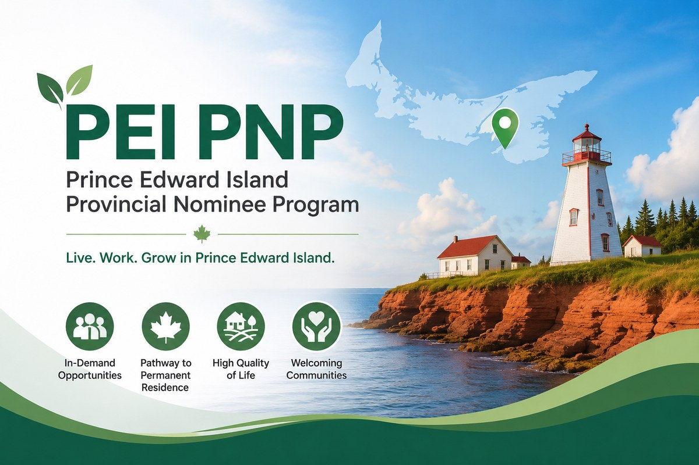

<a class="back-link" href="../provincial-nominee-programs.html">← 返回省提名项目 | Back to Provincial Nominee Programs</a>

PEI PNP | Provincial Immigration

# PEI省提名最新抽选：10月7日发出90份邀请，继续优先紧缺行业

<a class="language-jump" href="#english-version">Read in English</a>

2026年10月7日，爱德华王子岛省（PEI）进行了新一轮省提名EOI抽选，共发出90份邀请。

本轮邀请全部属于Labour &amp; Express Entry类别，Business Work Permit Entrepreneur企业家类别没有发出邀请。

<h2>2026年10月7日抽选结果</h2>

Labour &amp; Express Entry： 90份邀请

Business Work Permit Entrepreneur： 0份

最低邀请分数： 未公布

2026年累计邀请： 1,319份

上一轮抽选于9月17日举行，共发出195份邀请。

<h2>PEI目前优先考虑哪些申请人？</h2>

PEI继续重点关注医疗、技工、制造业及其他劳动力短缺行业。

相比之下，销售及服务行业的申请人可能面临较低的邀请机会。

需要注意的是，本轮抽选没有公布具体职业代码（NOC）或最低分数，因此不能认为全部90份邀请都来自上述优先行业。

<h2>对申请人的提醒</h2>

符合省提名申请条件，并不意味着一定能够获得邀请。

在目前的筛选机制下，申请人的职业、雇主支持、工作经验及是否符合PEI劳动力需求，都可能影响获得邀请的机会。

对于计划通过PEI省提名取得加拿大永久居民身份的申请人，建议提前联系我们评估职业及申请条件，制定适合自己的移民方案。

<a class="back-link" href="../provincial-nominee-programs.html">← 返回省提名项目 | Back to Provincial Nominee Programs</a>

<h2>PEI PNP Update: 90 Invitations Issued on October 7, 2026</h2>

On October 7, 2026, Prince Edward Island (PEI) conducted a new Expression of Interest (EOI) draw under its Provincial Nominee Program (PEI PNP), issuing 90 Invitations to Apply (ITAs).

All invitations were issued under the Labour &amp; Express Entry category. No invitations were issued under the Business Work Permit Entrepreneur Stream.

<h3>October 7, 2026 Draw Results</h3>

Labour &amp; Express Entry: 90 invitations

Business Work Permit Entrepreneur: 0 invitations

Minimum EOI Score: Not disclosed

Total Invitations in 2026: 1,319

The previous draw took place on September 17, 2026, when 195 invitations were issued.

<h3>Which Applicants Are Being Prioritized?</h3>

PEI continues to prioritize applicants working in sectors experiencing labour shortages, particularly healthcare, skilled trades, manufacturing, and other high-demand occupations.

Applicants working in sales and service occupations may face more limited opportunities to receive invitations.

However, PEI has not published specific National Occupational Classification (NOC) codes or minimum scores for this draw.

<h3>What Does This Mean for Applicants?</h3>

Meeting the eligibility requirements for PEI PNP does not guarantee an invitation.

Under the current selection system, factors such as occupation, employer support, work experience, and alignment with PEI&#x27;s labour market priorities may influence an applicant&#x27;s chances of receiving an invitation.

Applicants considering PEI PNP should carefully assess their eligibility and develop an immigration strategy based on current provincial priorities.

<h3>Need assistance with your immigration planning?</h3>

Ellen &amp; Kay Associates Consulting Ltd. provides professional immigration assessments and personalized immigration strategies.

Ellen &amp; Kay Associates Consulting Ltd.
Regulated Canadian Immigration Consultant (RCIC)
CICC Membership No.: R414455
Website: www.ellenlinrcic.ca

Official Source: Government of Prince Edward Island – Office of Immigration

<a class="back-link" href="../provincial-nominee-programs.html">← 返回省提名项目 | Back to Provincial Nominee Programs</a>

